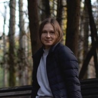

# **Gavrilova Maria**
## ☎️ **Contact information:** 
+ __Location:__ Russia, Moscow
+ __Tel:__+7(915)067-94-16
+ __Email:__ lassmary@bk.ru
+ __GitHub:__[botino-k](https://github.com/botino-k)
## 👩**About me:**
I'm a civil engineer. But I want to try my hand at something new.\
I have a technical education. I want to improve my english.\
I want to became a part of society of developers that includes many interesting people.
## 📐**Skills**
+ JS
+ HTML
+ CSS
+ Git
+ Figma
## 💻**Code example**
```
# Highest and Lowest
function highAndLow(numbers){
  let a = numbers.split(' ');
   return ( `${Math.max(...a)} ${Math.min(...a)}`);
}
```
## **Experience**
🐛
## :mortar_board:**Education**
+ [RS School Front-end 2021q3 stage1](https://app.rs.school)
+ Peoples' Friendship University of Russia, Civil Engineering, master's degree 
## :earth_americas:**Languages**
English (intermediate)

